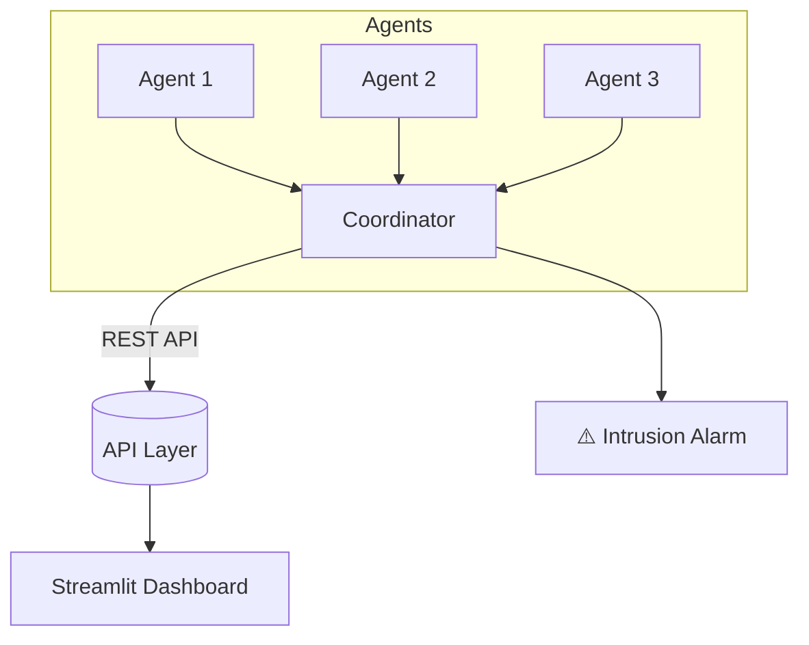

# VeriFace — Deepfake Intrusion Alarm  

**VeriFace** is a cloud-native system that detects and alerts against **deepfake intrusions** in real time.  
Built on **Google Cloud**, it uses distributed detection agents, a central coordinator, and an API with a Streamlit dashboard to provide seamless monitoring and visualization.  

---

## Project Description  

Deepfakes are increasingly being used in malicious contexts, from identity fraud to misinformation campaigns. VeriFace provides a practical defense by analyzing media streams and raising intrusion alarms when deepfake manipulation is detected.  

The system is designed to be **scalable, distributed, and user-friendly**, making it suitable for both demonstration and future real-world deployment.  

---

## Problem  

- Deepfakes are becoming harder to detect with the human eye.  
- Malicious actors exploit them for fraud, impersonation, and disinformation.  
- Existing detection tools are often isolated, hard to integrate, or lack real-time capabilities.  

---

## Solution  

**VeriFace** solves these issues by:  
- Deploying **distributed agents** that analyze media locally or in the cloud.  
- Using a **coordinator** to aggregate results and manage detection workflows.  
- Offering an **API layer** for programmatic access.  
- Providing a **Streamlit dashboard** for real-time intrusion monitoring and demo purposes.  
- Running on **Google Cloud**, ensuring scalability and easy deployment.  

---

## System Architecture  

### Mermaid Diagram

---

### Installation

#### Clone the repository 
git clone https://github.com/azhol001/veriface.git  
cd veriface

#### Create and activate a virtual environment 
python -m venv venv  
source venv/bin/activate    # On Linux/Mac  
venv\Scripts\activate        # On Windows

#### Install dependencies 
pip install -r requirements.txt

---

### Usage

#### Start the coordinator
python coordinator.py

#### Start one or more agents (in seperate terminals)

python blink_agent.py  
python lipsync_agent.py  
python voice_agent.py

#### Run the streamlit dashboard

streamlit run ui/streamlit_app.py 

#### Access the UI at: http://localhost:8501

---

### Demo Instructions

1. Start the coordinator service.  
2. Run one or more detection agents.  
3. Launch the Streamlit dashboard.  
4. Upload or stream video content via the UI.  
5. Observe real-time alerts when deepfake intrusions are detected.

---

### Hackathon Highlights

1. Built in under 48 hours during Shellhacks.  
2. Fully distributed design with scalable Google Cloud deployment.  
3. Real-time detection and alerting system.  
4. Intuitive Streamlit dashboard for live demo showcase.  
5. Demonstrates a practical defense against deepfake threats.  
